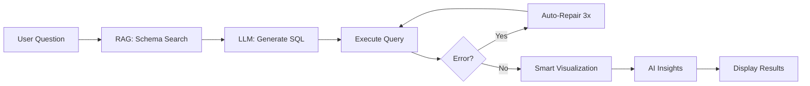

# 🤖 SQL Data Analyst Agent

[](https://www.python.org/downloads/)
[](https://streamlit.io)
[](https://langchain.com)
[](https://opensource.org/licenses/MIT)

> **AI-Powered Natural Language to SQL with Multi-Database Support**

A production-grade AI agent that converts natural language questions into SQL queries, executes them across multiple database types, visualizes results intelligently, and provides AI-generated insights.

🔗 **[Live Demo](#) | [Documentation](./docs/ARCHITECTURE.md) | [Quick Start](./docs/QUICKSTART.md)**

## ✨ Key Features

- 🗣️ **Natural Language Queries**: Ask questions in plain English
- 🗄️ **Multi-Database Support**: SQLite, MySQL, PostgreSQL, SQL Server, Oracle
- 📤 **File Upload**: CSV, Excel, SQLite files (auto-converted)
- 🔄 **Auto Error Recovery**: 3-attempt repair loop with LLM
- 📊 **Smart Visualizations**: Auto-detects chart types (bar, scatter, pie, time series)
- 🧠 **RAG-Enhanced**: Semantic search over database schema
- 💡 **AI Insights**: LLM-generated analysis of results
- 📥 **Export Options**: Download CSV or PDF reports
- 🎨 **Professional UI**: Clean, gradient design with tabs

## 🎯 How It Works



1. **Upload Database**: Drop CSV/Excel files or connect via connection string
2. **Ask Questions**: Type in natural language (e.g., "Show top 10 customers by revenue")
3. **AI Processing**: 
   - RAG searches schema for relevant tables/columns
   - Groq LLM generates optimized SQL query
   - Auto-fixes errors if query fails (up to 3 attempts)
4. **Visualization**: Auto-detects data patterns and creates appropriate charts
5. **Insights**: AI analyzes results and provides business insights

## 🏗️ Architecture

This project follows a clean, modular architecture designed for scalability and maintainability:

```
Data_analyst_agent/
├── 📁 agent/                # AI Agent & SQL Generation
│   ├── sql_agent.py         # Main LangChain agent
│   ├── error_handler.py     # SQL error repair (3 attempts)
│   ├── sql_validator.py     # Query validation
│   ├── sql_explainer.py     # Query explanation
│   ├── query_optimizer.py   # Query optimization
│   └── tools.py             # Agent tools
├── 📁 config/               # Configuration
│   └── settings.py          # Environment variables & settings
├── 📁 database/             # Database Layer
│   ├── connection_manager.py # Multi-database connections
│   ├── schema_discoverer.py  # Auto schema discovery
│   ├── db_manager.py        # Query execution
│   └── db_setup.py          # Database initialization
├── 📁 rag/                  # RAG System
│   ├── dynamic_vector_store.py # Per-session vector stores
│   ├── schema_loader.py     # Schema indexing
│   └── query_expander.py    # Query expansion
├── 📁 ui/                   # Frontend (Streamlit)
│   ├── app.py               # Main application
│   ├── components.py        # UI components
│   └── visualizer.py        # Smart charts (auto-detect)
├── 📁 utils/                # Utilities
│   ├── pdf_generator.py     # PDF report generation
│   └── performance_tracker.py # Performance monitoring
├── 📁 docs/                 # 📚 Documentation
│   ├── README.md            # Documentation index
│   ├── ARCHITECTURE.md      # System architecture
│   ├── QUICKSTART.md        # Quick start guide
│   ├── GROQ_SETUP.md        # API setup
│   └── ...                  # More guides
├── 📁 data/                 # Data Storage (generated at runtime)
│   ├── uploads/             # User uploaded files
│   └── chroma_db/           # Vector DB persistence
├── 📄 .env.example          # Environment template
├── 📄 requirements.txt      # Python dependencies
├── 📄 setup.py              # Database setup script
└── 📄 README.md             # This file
```

> **Note**: `data/`, `session_vector_stores/`, and `.env` are auto-generated at runtime and excluded from git.

## 🚀 Tech Stack

- **Backend**: Python 3.13
- **Agentic Framework**: LangChain (agent with tools)
- **LLM**: Groq (llama-3.3-70b-versatile) - FREE tier with 14,400 requests/day!
- **Embeddings**: Simple SHA-384 based embeddings (no external API needed)
- **RAG**: Chroma vector database with per-session isolation
- **Databases**: 
  - SQLite (embedded)
  - MySQL
  - PostgreSQL
  - SQL Server
  - Oracle
- **Frontend**: Streamlit (gradient design, tabs, responsive)
- **Visualization**: Plotly for interactive charts (auto-detection)
- **Export**: CSV and PDF generation (ReportLab)

## 📊 Database Schema

The project includes a sample sales analytics database with:

- **customers**: Customer information (id, name, email, country, segment)
- **products**: Product catalog (id, name, category, price)
- **orders**: Order transactions (id, customer_id, order_date, status, total_amount)
- **order_items**: Line items (id, order_id, product_id, quantity, unit_price)

## 🎯 Core Features

### Natural Language Processing
- ✅ Convert questions to SQL using Groq llama-3.3-70b
- ✅ Context-aware query generation with RAG
- ✅ Dynamic example questions based on actual schema
- ✅ Identifies ID, percentage, and score columns intelligently

### Database Operations
- ✅ Multi-database support (SQLite, MySQL, PostgreSQL, SQL Server, Oracle)
- ✅ File upload (CSV, Excel, SQLite) with auto-conversion
- ✅ Connection string support for remote databases
- ✅ Automatic schema discovery and indexing
- ✅ Per-session isolation for multi-user support
- ✅ Table name sanitization (handles special characters)

### Query Execution
- ✅ Safe SQL execution with validation
- ✅ Automatic error detection and repair (3 attempts)
- ✅ Schema-aware error fixing with LLM
- ✅ Handles syntax errors, missing columns, type mismatches

### Visualization
- ✅ Auto-detects appropriate chart types:
  - Time series data → Line charts with area fill
  - Categorical + Numeric → Bar charts (top 15)
  - Few categories → Pie/donut charts
  - Two numeric columns → Scatter plots with trendlines
- ✅ Smart sampling for large datasets (500 points)
- ✅ Interactive Plotly charts (zoom, hover, pan)
- ✅ Key metrics with range display
- ✅ Handles ID columns separately (no "highest ID" metrics)

### Insights & Analysis
- ✅ AI-generated insights from query results
- ✅ SQL query explanation
- ✅ Query optimization suggestions
- ✅ Performance analysis

### User Experience
- ✅ Clean gradient UI (#667eea to #764ba2)
- ✅ Tab-based results (Visualization, Insights, Data, SQL, Analysis)
- ✅ Connection info header with visible colors
- ✅ Persistent query input (results don't disappear)
- ✅ Copy SQL button (JavaScript, no reload)
- ✅ Download CSV and PDF reports
- ✅ Previous results remain visible
- ✅ Real-time feedback on every action

### Documentation
- ✅ 18 comprehensive markdown files
- ✅ Architecture documentation
- ✅ Setup guides and troubleshooting
- ✅ Visual guide with screenshots
- ✅ Multi-database guide

## 🛠️ Setup Instructions

### 1. Clone and Navigate
```bash
cd Data_analyst_agent
```

### 2. Create Virtual Environment
```bash
python -m venv venv
# Windows
.\venv\Scripts\activate
# Linux/Mac
source venv/bin/activate
```

### 3. Install Dependencies ✅
```bash
pip install -r requirements.txt
```
**Status**: ✅ Already completed! All packages including `langchain-groq` and `sentence-transformers` are installed.

### 4. Configure Environment ⚠️
```bash
# The .env file is already set up, you just need to add your API key
# Edit .env and add your Groq API key (get it from https://console.groq.com/keys)
# GROQ_API_KEY=gsk-your-actual-key-here
```
**Status**: ⚠️ **ACTION REQUIRED** - Get your free Groq API key and add it to `.env`

See **GROQ_SETUP.md** for detailed instructions on getting your API key.

### 5. Initialize Database & Vector Store
```powershell
python setup.py
```

This will:
- Create the SQLite database with the sales analytics schema
- Populate it with sample data (100+ records)
- Initialize the Chroma vector store with schema embeddings (using free HuggingFace model)

**Status**: ⏳ Ready to run after adding API key

### 6. Run the Application
```powershell
streamlit run ui/app.py
```

The app will open in your browser at `http://localhost:8501`

**Status**: ⏳ Ready to launch after setup

## 💡 Usage Examples

### Quick Start Queries
```
"Show me the first 10 rows"
"How many records are in the table?"
"What columns are available?"
```

### Analytics Queries
```
"Top 5 students by attendance percentage"
"Show total sales by product category"
"What is the average test score by class?"
"Compare attendance and test scores"
```

### Advanced Queries
```
"Which students have attendance above 80% and test scores below average?"
"Show correlation between attendance and final exam scores"
"Find all customers who placed orders in the last 30 days but never returned"
"What products generate the most revenue per category?"
```

### Multi-Table Queries
```
"Show customer names with their total order value"
"List products that have never been ordered"
"Which category has the highest profit margin?"
```

### Time-Based Queries
```
"Show sales trends by month for 2024"
"What day of the week has the most orders?"
"Compare Q1 vs Q4 revenue"
```

The agent automatically:
- Determines which tables to query
- Writes the SQL with JOINs if needed
- Executes and fixes any errors
- Generates appropriate visualizations
- Provides AI insights

## 🔧 Extending the System

### Adding a New Database

1. Update `database/db_setup.py` with your schema
2. Run the setup script to create tables and data
3. The RAG layer will automatically index the new schema

### Switching LLM Provider

1. Update `config/settings.py` with new provider credentials
2. Modify `agent/sql_agent.py` to use the new LLM client
3. Update tool implementations if needed

### Adding Custom Tools

1. Create new tool functions in `agent/tools.py`
2. Register them in the agent initialization
3. Update the system prompt if needed

## 🏛️ Design Principles

- **Separation of Concerns**: Each module has a single, well-defined responsibility
- **Type Safety**: Comprehensive type hints throughout the codebase
- **Documentation**: Detailed docstrings for all functions and classes
- **Error Handling**: Robust error handling with informative messages
- **Extensibility**: Easy to add new databases, tools, or LLM providers
- **Production-Ready**: Configuration management, logging, and best practices

## 📝 Project Structure Details

### Config Layer
Centralizes all configuration management, environment variables, and application settings.

### Database Layer
Handles all database operations including connection management, schema creation, and query execution.

### RAG Layer
Implements semantic search over database schema using Chroma vector store to provide context to the LLM.

### Agent Layer
Contains the LangChain agent with tools for SQL generation, execution, and error repair.

### UI Layer
Streamlit-based frontend with components for query input, results display, visualization, and insights.

## 📸 Screenshots

### Query Interface
Clean, intuitive interface with example questions based on your actual database schema.

### Smart Visualizations
Auto-generated charts that match your data patterns (bar, scatter, time series, pie charts).

### AI Insights
Get instant business insights and explanations for your query results.

*See [VISUAL_GUIDE.md](./docs/VISUAL_GUIDE.md) for detailed screenshots*

## 🤝 Contributing

Contributions are welcome! Please feel free to submit a Pull Request. For major changes:

1. Fork the repository
2. Create your feature branch (`git checkout -b feature/AmazingFeature`)
3. Commit your changes (`git commit -m 'Add AmazingFeature'`)
4. Push to the branch (`git push origin feature/AmazingFeature`)
5. Open a Pull Request

### Production Enhancements
For production deployment, consider:

- ✅ Authentication and authorization (OAuth/SAML)
- ✅ Query result caching (Redis)
- ✅ Advanced visualization types (heatmaps, funnel charts)
- ✅ Multi-database concurrent access
- ✅ Query history and bookmarking
- ✅ API endpoints (FastAPI integration)
- ✅ Containerization (Docker/Kubernetes)

## 📄 License

MIT License - Feel free to use this project as a template for your own applications.

See [LICENSE](./LICENSE) file for details.

## 👨‍💻 Author

**INCREDIBLE18**

Built as part of the MYAIGURU AI Engineering Build Round (November 2025)

## 🙏 Acknowledgments

- **Groq**: For providing free, fast LLM inference
- **LangChain**: For the agent framework
- **Streamlit**: For the amazing UI framework
- **Chroma**: For the vector database

## 📞 Support

For issues, questions, or suggestions:

- 📧 Open an issue on [GitHub Issues](https://github.com/INCREDIBLE18/Data_analyst_agent/issues)
- 📖 Check the [Documentation](./docs/ARCHITECTURE.md)
- 🔧 See [Troubleshooting Guide](./docs/TROUBLESHOOTING.md)

---

⭐ **Star this repo** if you find it helpful!

🔗 **Repository**: [https://github.com/INCREDIBLE18/Data_analyst_agent](https://github.com/INCREDIBLE18/Data_analyst_agent)
